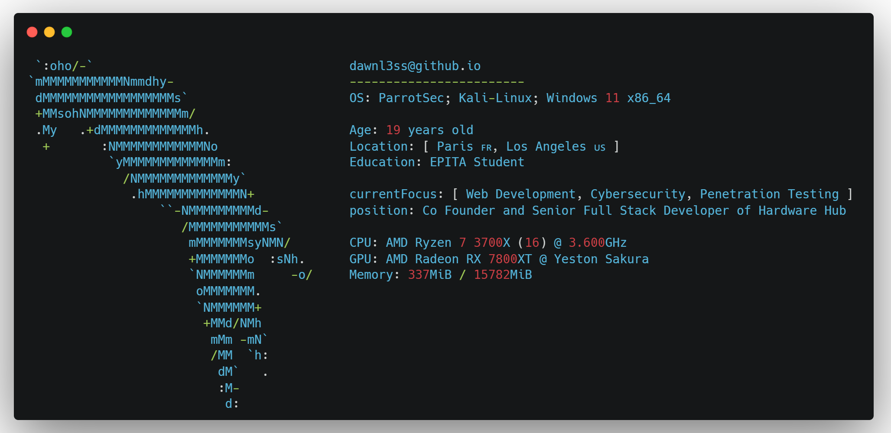

<div align="center">

  
</div>
<br>



<br>

## 💻 Tech Arsenal

<details open>
<summary><b>🌐 Web Development</b></summary>
<br>


</details>

<details open>
<summary><b>⚙️ Systems Programming</b></summary>
<br>


</details>

<details open>
<summary><b>🔒 Cybersecurity</b></summary>
<br>


</details>

<br>

## 🏆 Achievements & Certifications

<div align="center">
  
  <a href="https://tryhackme.com/p/dawnl3ss">
    
  </a>
  <a href="https://app.hackthebox.com/profile/1321357">
    
  </a>
  
</div>

<br>

## 📊 GitHub Analytics

<div align="center">
  
  
</div>

<div align="center">
  
</div>

<br>

## 🏆 GitHub Trophies

<div align="center">
  
</div>

<br>

## 🌐 Network Connections

```bash
$ netstat -social
```

<div align="center">

  [](https://dawnl3ss.me/)
  [](https://www.linkedin.com/in/alexvsn/)
  [](https://discordapp.com/users/358529816145821696)
  [](https://twitter.com/_dawnl3ss)
  [](mailto:dawnl3ss@gmail.com)

</div>


<div align="center"> 


</div>
